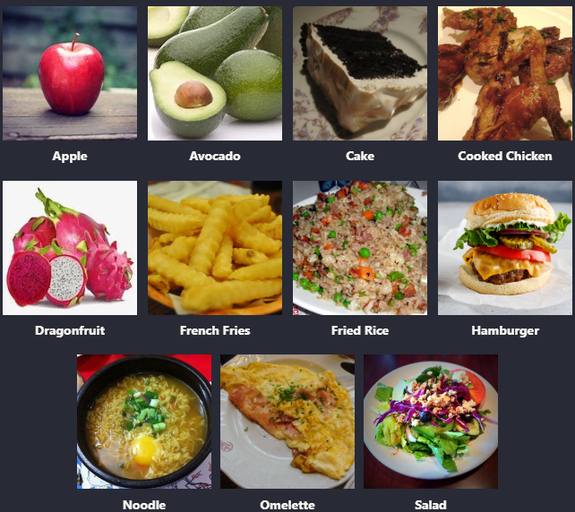

# Machine Learning Diabetless

<p align='center'>
  
</p>

Diabetless's Machine Learning team build a multilabel object recognition model with transfer learning method using pretrained YOLOv8 architecture. The model goes through several phases of fine-tuning hyperparameters to get the best results. The final result is a trained model that has been converted to TensorFlowjs-node format, so it can perform server-side predictions with javascript.

## Folder Structures
Before delving into the code, it's crucial to grasp the project's folder arrangement. Below is a broad summary of the directory layout.
```bash
machine-learning
├───assets           # Static assets (image, etc) for README.
├───images           # Store images file to used in prediction demo
├───model            # Food object detection model in TFjs converted format
├───utils            # Utility and helper scripts to preprocess the dataset
├───classes.json     # List of classes/labels name
├───Model.ipynb      # Encapsulated model creation steps
└───predict.js       # Prototype of deployed model API
```

## Datasets
We use Food Image datasets from kaggle which contain 11 classes of images :


The datasets labelled using LabelImg with 3 splits (train, test, val) package and saved as **.zip** file in **[datasets.zip](https://drive.google.com/file/d/186HlpFc60T0jWYrJPodAJNtYK6Hgr2tg/view?usp=sharing)**


## Getting Started
You can try the demo of Food Object Detection model using Tensorflowjs-node with prototype API.

### Prerequisites
- [Nodejs](https://nodejs.org/en) v18.12.0 or above 
- [NPM](https://www.npmjs.com/)
- [TFjs-node](https://www.npmjs.com/package/@tensorflow/tfjs-node)

### Installation
1. Fork to your github and Clone the repository
```shell
git clone https://github.com/<your_github_username>/machine-learning.git
```
2. Install the dependencies needed
```
npm install
```

### Usage
1. Copy your image to [images](./images/) folder
2. Run the code with additional argument
```
node predict.js [IMAGE_FILEPATH]
```
3. The results will be array of classes that detected in the image.

### Example
Prediction using ```test-image.jpg```
```
node predict.js ./images/test-image.jpg
```
Example result
```javascript
[ 'noodles', 'french fries', 'hamburger' ]
```
